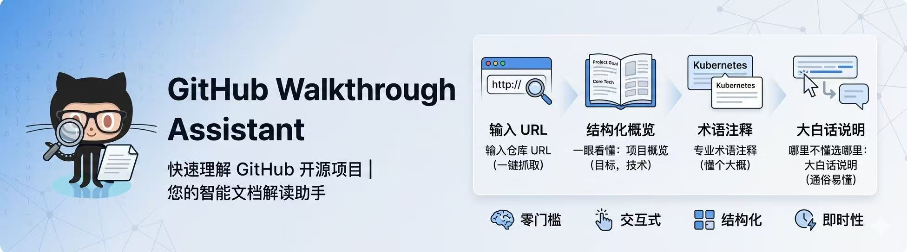
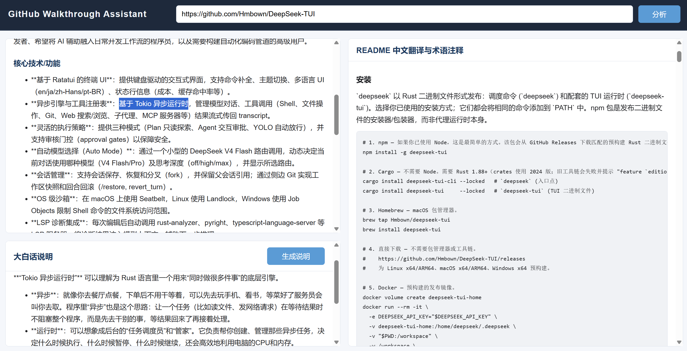

## 1、项目目标

帮助用户快速理解 GitHub 上的开源项目。输入仓库 URL，即可获得 README 的中文翻译、专业术语注释、结构化项目概览，以及对任意段落的大白话辅助说明——全部在同一个网页界面中完成。

## 2、项目价值

技术文档往往英文密集、术语晦涩、项目逻辑分散在多个文件中，阅读门槛高。本项目将理解一个 GitHub 项目的完整流程压缩为**三步操作**：

1. **输入 URL** → 自动抓取仓库信息
2. **一眼看懂** → 左侧概览面板呈现项目目标、解决的问题、核心技术、硬件要求
3. **哪里不懂选哪里** → 在当前网页中直接选中任意内容，点击按钮即可生成通俗的中文解释

核心价值：
- **零门槛**：不需要英语阅读能力，不需要专业背景
- **交互式**：主动选中困惑段落获得解释，而非被动阅读全文
- **结构化**：四点概览帮助快速判断项目是否适合自己
- **即时性**：网页界面操作，无需命令行


## 3、快速启动

### 3.1 公网入口
http://8.133.178.210/github-walkthrough-assistant/

### 3.2 安装依赖

```bash
python -m pip install -r requirements.txt
```

### 3.3 配置环境变量

在项目根目录创建 `.env`：

```text
DEEPSEEK_API_KEY=你的 DeepSeek API Key
DEEPSEEK_MODEL=deepseek-chat
GITHUB_TOKEN=可选，用于提高 GitHub API 额度
```

### 3.4 启动网页界面

```bash
python -m uvicorn src.app:APP --host 127.0.0.1 --port 8010
```

浏览器打开：

```text
http://127.0.0.1:8010
```

### 3.5 命令行脚本

README 中文翻译：

```bash
python -m src.run_mvp1 https://github.com/owner/repo
```

项目概览生成：

```bash
python -m src.run_mvp2 https://github.com/owner/repo
```

大白话辅助说明：

```bash
python -m src.run_mvp3 --text "需要解释的文本"
```

## 4、相关定义

### 核心技术 / 功能
项目实现所必须的技术方案、算法、架构或功能模块，是抽象层面的技术要求。
- 例如：Transformer 架构、混合注意力机制、多 Agent 协作
- 强调技术思路和架构设计，而非运行依赖

### 硬件 / 软件要求
项目运行或训练所必须满足的客观资源约束。
- 例如：GPU 型号与数量、CPU 核数、内存大小、依赖库
- 帮助评估项目可执行性和硬件需求


## 5、示意图


